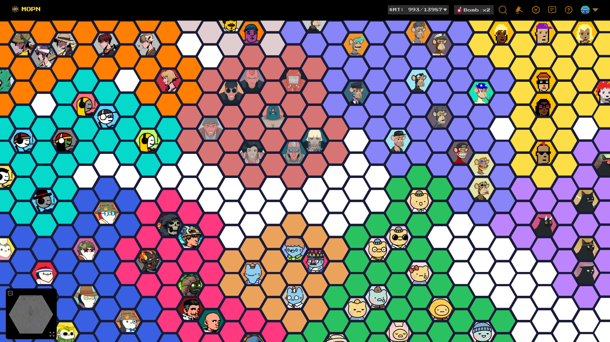
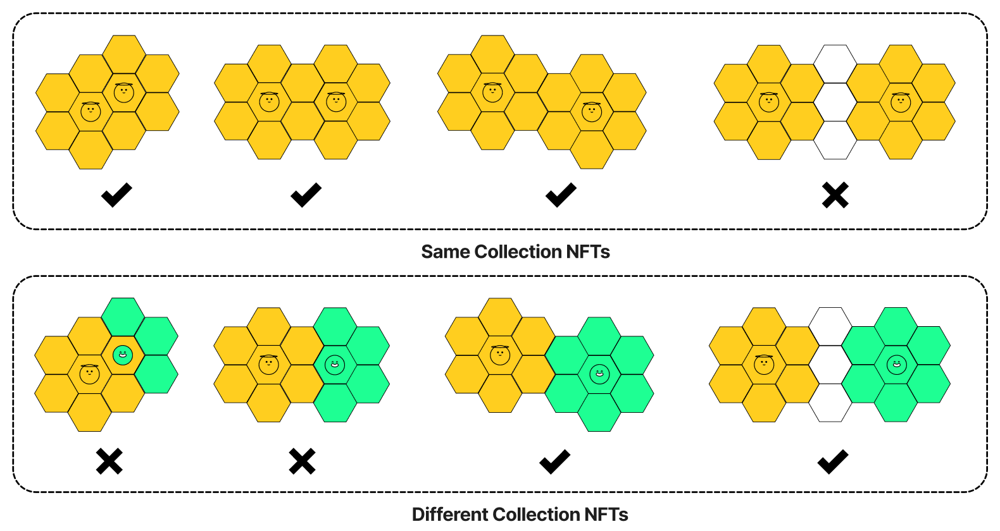
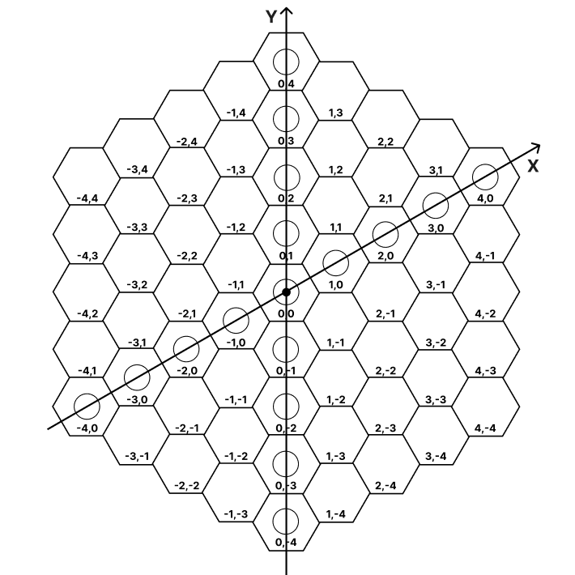
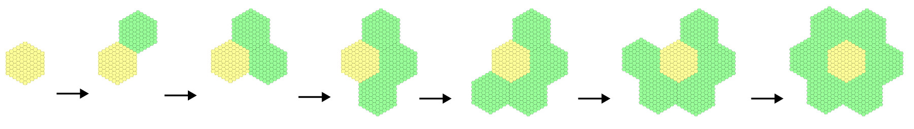

# MOPN

## Overview

MOPN is a Map Of Popular NFTs, with $MT(MOPN Token) as the economic driver.

By simple rules of collaboration and competition, MOPN will help NFT collectors to gain more profits and attention.

Fully on-chain, fair launch, open-source contracts on Ethereum with no admin.

<figure><figcaption>
MOPN Prototype
</figcaption></figure>

## Account

1. Users use the wallet as their account to access MOPN.
2. The contract only checks NFT ownership in the wallet and can not authorize or transfer NFTs.
3. Supporting wallet delegate protocols such as [http://warm.xyz](https://t.co/WGWLQY9try) or [http://delegate.cash](https://t.co/Spha4pZXJp).
4. Only whitelisted collections can participate during the launch phase. After that, all NFTs can participate.

## Place

Users can place their own NFTs on MOPN map tiles. The territory is 7 tiles centered by the NFT placed on the map.

NFTs from the same collection form an alliance. Adjacent alliance territories can overlap, while territories from different alliances cannot overlap but can be adjacent.

<figure><figcaption>
Placing Rules
</figcaption></figure>

After placing NFT, the $MT rewards are allocated to NFT holder, NFT collection vault, and land holder in a ratio of 90%, 5%, and 5%.

## Tile

Tile is the basic unit on the map, and each tile is a regular hexagon with a unique coordinate. There are a total of 999,271 tiles on the map.

<figure aligen="center"><figcaption>
Tile Coordinate
</figcaption></figure>

Every 91 tiles form a land, and there are 10,980 lands that make up the entire MOPN map, surrounded by a central area.

<figure><figcaption>
Rules for Land Surroundings
</figcaption></figure>

There are three types of tiles in the MOPN: Common, Rare, and Legendary, each with different weights.

| Types     | icon                                                           | Tile Weight | Percentage | Amount |
| --------- | -------------------------------------------------------------- | ----------- | ---------- | ------ |
| Common    | -                                                              | 1           | 81%        | 809212 |
| Rare      |   | 5           | 18%        | 180032 |
| Legendary |  | 15          | 1%         | 10027  |

##
