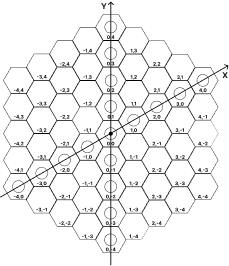
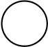

# Litepaper

## Overview

MOPN is a dynamic map showing all the stories of the NFT world, discovering the most popular NFTs.

Users can earn energy and compete for tiles by placing their NFTs on the map, which leads to dynamic updates.

Fully on-chain, fair launch, open-source contracts on Ethereum with no admin.

<figure><figcaption>
MOPN Prototype
</figcaption></figure>

## Account

1. Users use the wallet as their account to access MOPN.
2. The contract only checks NFT ownership in the wallet and can not authorize or transfer NFTs.
3. Supporting wallet delegate protocols such as [http://warm.xyz](https://t.co/WGWLQY9try) or [http://delegate.cash](https://t.co/Spha4pZXJp).
4. Only whitelisted collections can participate during the launch phase. After that, all NFTs can participate.

## Place

1. Users can place their own NFTs on MOPN map tiles.
2. The territory is 7 tiles centered by the NFT placed on the map.
3. NFTs from the same collection form an alliance.
4. Adjacent alliance territories can overlap, while territories from different alliances cannot overlap but can be adjacent.
5. After placing NFT, the $ENERGY rewards are allocated to NFT holder, NFT collection vault, and land holder in a ratio of 90%, 5%, and 5%.

<figure><figcaption>
Place Rule
</figcaption></figure>

## Tile

Tile is the basic unit on the map, and each tile is a regular hexagon with a unique coordinate. There are a total of 999,271 tiles on the map.

<figure><figcaption>
Tile Coordinate
</figcaption></figure>

Every 91 tiles form a land, and there are 10,980 lands that make up the entire MOPN map, surrounded by a central area.

<figure><figcaption>
Land Composite Rule 
</figcaption></figure>

There are three types of tiles in the MOPN: Common, Rare, and Legendary, each with different weights.

| 
 
 | Icon                                                                                         | Tile Weight | Percentage | Amount |
| ----------- | -------------------------------------------------------------------------------------------- | ----------- | ---------- | ------ |
| Common      | -                                                                                            | 1           | 81%        | 809212 |
| Rare        |  | 5           | 18%        | 180032 |
| Legendary   |  | 15          | 1%         | 10027  |

## Land

Land is an ERC-721 NFT with a fixed total supply of 10,981, and each land consists of 91 tiles.

<figure><figcaption>
Land NFT Thumbnail
</figcaption></figure>

After a land is minted, NFTs can be placed on its tiles, and the land NFT will display the occupying alliance.

The land holder can receive 5% of the $ENERGY yield from the 91 tiles it contains.

All land NFT is issued through two methods: ETH curve minting and $ENERGY auction minting.

### How to obtain

#### ETH Curve Minting

Pricing starts at 0.02 ETH, with a price increase of 1‰ for each completed ETH curve mint. ETH curve minting will be available soon.

#### $ENERGY Auction Minting

Through a Dutch auction, starting from 10,000,000 $ENERGY, one land will be auctioned off each round, with the price decreasing by 1% per minute. When the current $ENERGY Auction Minting is complete, the next round will automatically start.

#### BUY

Users can buy land NFT on marketplaces such as OpenSea.

## $ENERGY

1. $ENERGY is an ERC-20 token with a total supply of 100,000,000,000. The initial yield is 6,000 per block, and it decreases by 0.3% every 50,000 blocks.
2. All NFTs placed on tiles automatically receive $ENERGY yield per block based on their weight (requires manual claiming).
3. $ENERGY is used to auction bombs and lands, with 100% of the $ENERGY used for auction being burned.

<figure><figcaption>
$ENERGY Yield Trends
</figcaption></figure>

### How to obtain

#### NFT Placing Yield

Users can yield $ENERGY by placing their owned NFTs on unoccupied tiles on the MOPN map.

$$NFTPlacingYield(Perblock)={(\cfrac{NFT Weight+Tile Weight}{Total NFT Weight+Total Tile Weight}}\times{ENERGY Yield Perblock})*90\%$$

#### Alliance Placing Reward

Placing an NFT on a tile can immediately earn an energy reward from the alliance vault.

$$AllianceVaultReward={\cfrac{AllianceVault}{TotalAllianceNFTsCount+1}}$$

#### Land Tax

Land NFT holders can permanently receive a 5% tax share from the $ENERGY yield on 91 Tiles of the land.

#### BUY

Users can buy land NFT on dex such as uniswap.

## Bomb

1. BOMB is an ERC-1155 token, with 100 tokens auctioned daily via Last Price Dutch Auction.
2. Using BOMB can remove all NFTs on the 7 Tiles centered around the placement point. The NFT used for bombing will not be affected.
3. BOMB will be burned after use. Allocation weight will +1 of NFT using BOMB.

<figure><figcaption>
Bomb affect range
</figcaption></figure>

### How to obtain

#### LPDA

Through a Last Price Dutch Auction (LPDA), starting from 1,000,000 $ENERGY, 100 bombs will be auctioned off each round, with the price decreasing by 1% per minute. BOMBs can be minted at any time in quantities less than the remaining tokens for the current round.

<figure><figcaption>
Auction Price Trends
</figcaption></figure>

Once all the 100 tokens are auctioned out, the next round will automatically start.Transactions that bid higher than the current minimum bid will receive an $ENERGY refund for the difference.

#### BUY

Users can buy BOMB on marketplaces such as OpenSea.
