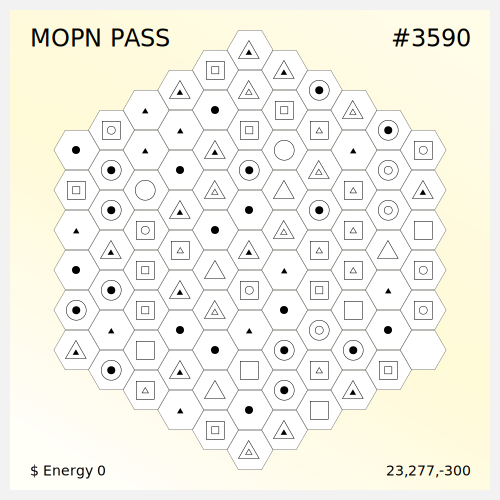

# Pass

There are 999,271 blocks on the Map, and each Pass has 91 blocks, which makes the total number of Pass **10,981**. The cover of each Pass is the blocks on the map.

<figure><figcaption>
MOPN PASS NFT
</figcaption></figure>

 

<figure><figcaption>
MOPN PASS NFT
</figcaption></figure>

