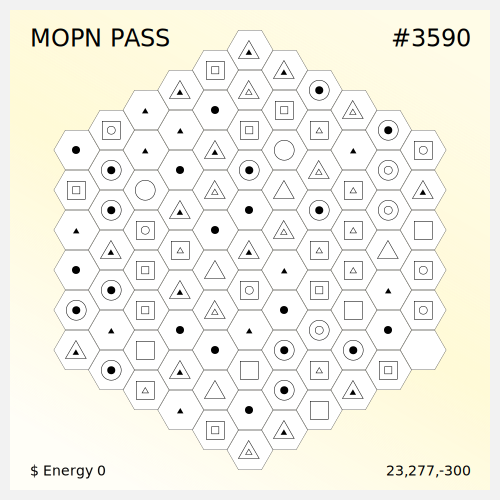
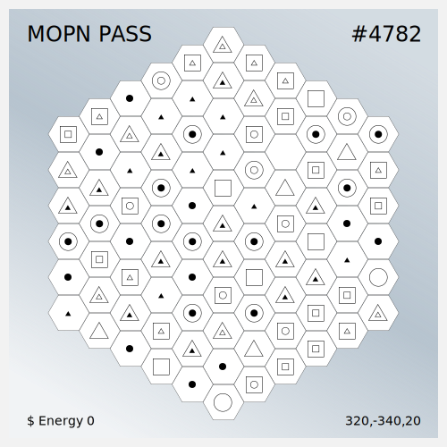

# Pass Mint

<figure><figcaption></figcaption></figure>

 

<figure><figcaption></figcaption></figure>

There will be 3 round Pass Mint. All the passes are available, 0 is reserved for the team.&#x20;

All the funds from Pass Mint will be used for the development of MOPN. MOPN will announce our expenditure to the community at a fixed period of time.

| **Round** | **Amount** | **Price**              | **Pattern** | **Phase**      |
| --------- | ---------- | ---------------------- | ----------- | -------------- |
| First     | 2000       | Fixed Price(0.05E)     | Whitelist   | Project Setup  |
| Second    | 3000       | Vote from Pass Holders | Public Mint | Testnet Launch |
| Third     | 5981       | Vote from Pass Holders | Public Mint | Mainnet Launch |

