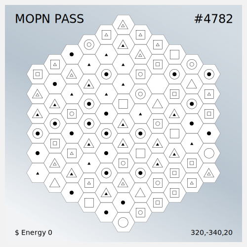

# Pass

There are 999,271 blocks on the Map, and each Pass has 91 blocks, which makes the total number of Pass **10,981**. The cover of each Pass is the blocks on the map.

<figure><figcaption>
MOPN PASS NFT
</figcaption></figure>

 

<figure><figcaption>
MOPN PASS NFT
</figcaption></figure>

## Pass holders will have the previleges

1. Community Governance
2. $Energy Recycling
3. Priority of MOPN following games

## Rarity

&#x20;**1、Block Level**

In 10,981 Passes, each Pass has 91 blocks with the same amount of each block level randomly distributed. &#x20;

(Detail as [Block Level](../usdenergy/block-level.md))

&#x20;**2、Block Type**

In 10,981 Passes: &#x20;

127 Passes cover all Gold Type blocks（1.16%） &#x20;

960 Passes cover all Silver Type blocks（8.74%） &#x20;

9,894 Passes cover other Regular Type blocks (90.1%)&#x20;

&#x20;(Detail as [Block Type](../usdenergy/block-type.md))
