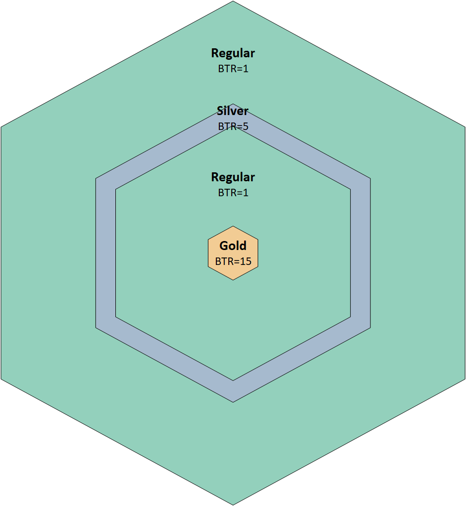

# Earn

$ENERGY is generated by alliance regions automatically every day and equally distributed to avatars in the alliance.

The output of each Block is associated with [Block Type](../../how-to-play/map-system.md#block-type) and [Level](../../how-to-play/map-system.md#block-level).

$$
ENERGY\space Earn=\dfrac{∑(RBA×BLG×BTR)}{NAA}
$$

* RBA (The Region Blocks of Alliance)
* BLG (The [Block Level](../../smart-contracts/pass-nft-collection/block-level.md) Generation)
* BTR ( [Block Type](../../how-to-play/map-system.md#block-type) Ratio):
* NAA (Number of Avatars in Alliance)

<figure><figcaption></figcaption></figure>

BLG：

| **Block Level** | **Block Level Generation** |
| --------------- | -------------------------- |
| LV0             | 0                          |
| LV1             | 0.125                      |
| LV2             | 0.25                       |
| LV3             | 0.375                      |
| LV4             | 0.5                        |
| LV5             | 0.625                      |
| LV6             | 0.75                       |
| LV7             | 0.875                      |
| LV8             | 1                          |
| LV9             | 1.125                      |
| LV10            | 1.25                       |
| LV11            | 1.375                      |

|   |
| - |
