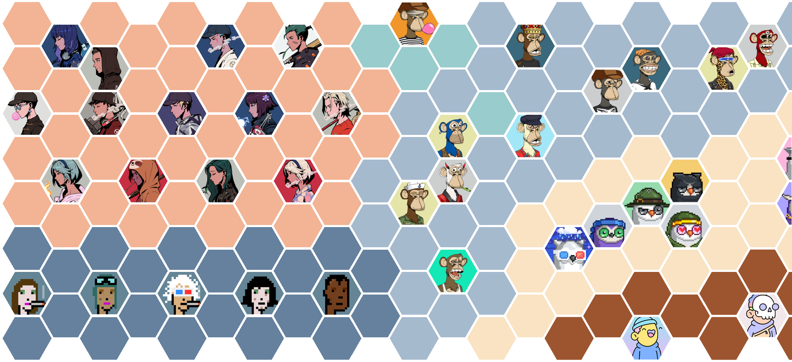
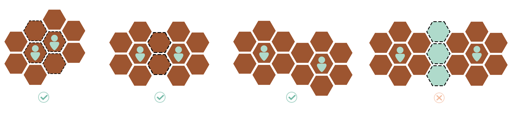
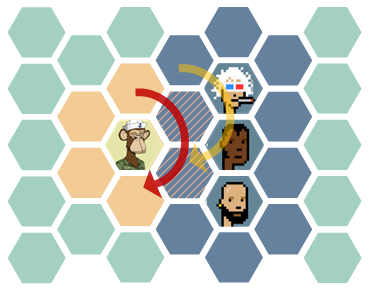

# Game System

Place

The place rule is that the same alliance region must be contiguous or overlapped.

<figure><figcaption></figcaption></figure>

<figure><figcaption></figcaption></figure>

The avatar placed on the map has initial attributes:

* HP：1
* ATT：0
* STA：0

Players can use [POM](prop-system.md) to enhance the attributes of the avatar.

## Remove

The avatar will be removed from the map under certain circumstances：

* Players remove the avatar from the map
* HP is 0 during the war
* HP is 0 under the the effect of [POM](prop-system.md)
* The related NFT is burned on chain

All attributes will initialized once the avatar is removed from the map.

## Move

The avatar can move on the map with the cost of STA following the same rule of place.&#x20;

The cost of STA to move from block a to b, formula is below:

&#x20;$$f(a, b) = (abs(a.q - b.q) + abs(a.s - b.s) + abs(a.r - b.r))/2$$

## War

War will happen when the regions of two alliances overlap.

War rules:

* From 12 o'clock of the avatar, detection of overlap block clockwise
* If there is an overlap block, war will begin between avatars occupying the region
* If there is more than 1 enemy, from 12 o'clock of the avatar, war with each enemy clockwise
* During the war, ATT will contiously cost HP from both sides until the HP of anyone is 0
* The war will end until the region no longer overlapped

<figure><figcaption></figcaption></figure>
