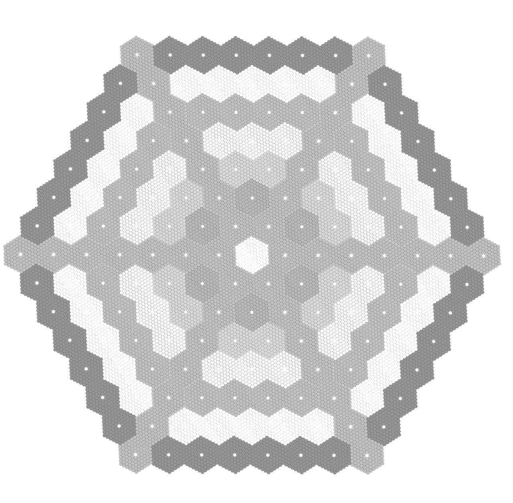
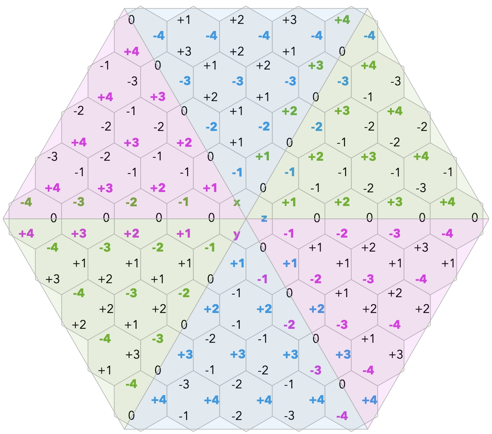
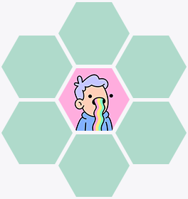

# Map System

## Map

The whole map of MOPN is a symmetrical hexagon consisting of 999,271 blocks.

The thumbnail of the map is shown below:

<figure><figcaption></figcaption></figure>

## Block

Block is the basic unit on the map, and it is also a hexagon. For each block, a NFT can be placed.

## Block Type

There are three types of Block with different [$ENERGY](../economic-system/usdenergy/) basic generation ratios.

| **Block Type** | **Block Type Ratio** |
| -------------- | -------------------- |
| Regular        | 1                    |
| Silver         | 5                    |
| Gold           | 15                   |

## Block Level

There are 13 levels of Block.

There are different [$ENERGY Generate](../economic-system/usdenergy/block-type.md) coefficients (how much $ENERGY can get in 24 hours) for each Block level.

| **Block Level** | **Logo**                                                          |
| --------------- | ----------------------------------------------------------------- |
| LV0             | null                                                              |
| LV1             |   |
| LV2             |   |
| LV3             |   |
| LV4             |   |
| LV5             |   |
| LV6             |   |
| LV7             |   |
| LV8             |   |
| LV9             |   |
| LV10            |  |
| LV11            |  |
| LV12            |  |

## Coordinate

Each block on the map has a unique coordinate. Cube coordinates are used to identify the block as (x,y,z), for any coordinate, x+y+z=0.

<figure><figcaption></figcaption></figure>

## Region

The region is 6 blocks centered by the NFT placed on map.

<figure><figcaption></figcaption></figure>

War will happen when the regions of two alliances overlap.

<figure><figcaption></figcaption></figure>

The region of the collection is all the region occupied by NFTs from the collection. On the map, it shows as same colour and badge.

<figure><figcaption></figcaption></figure>
