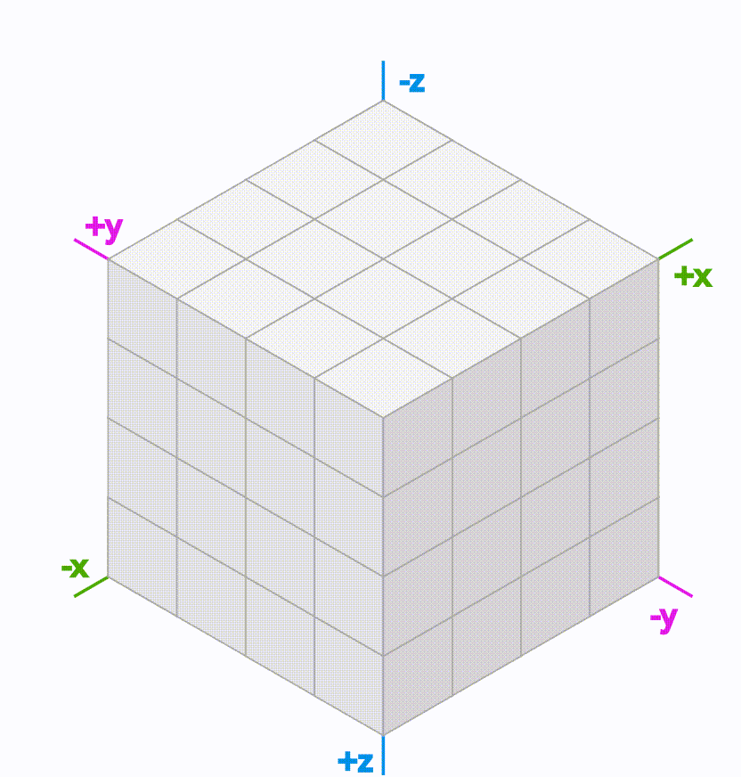

# Coordinate System

Coordinate for Hexagonal Grids has multiple approaches. We use cube coordinates because it's good for algorithms.

What is Cube Coordinates?

In Cube Coordinates there are three primary axes hexagonal grids. There's an elegant symmetry with these.

Let's take a cube grid and slice out a diagonal plane at `x + y + z = 0`. It helps us with hex grid algorithms:

<figure><figcaption></figcaption></figure>

1. 3d cartesian coordinates follow standard vector operations: we can add/subtract coordinates, multiply/divide by a scalar, etc. We can reuse these operations with hexagonal grids.
2. 3d cartesian coordinates have existing algorithms like distances, rotation, reflection, line drawing, conversion to/from screen coordinates, etc. We can adapt these algorithms to work on hexagonal grids.

Study how the cube coordinates work on the hex grid.

<figure><figcaption></figcaption></figure>

1. Each direction on the cube grid corresponds to a _line_ on the hex grid.&#x20;
2. Each direction on the hex grid is a combination of _two_ directions on the cube grid. For example, northwest on the hex grid lies between the `+y` and `-z`, so every step northwest involves adding 1 to y and subtracting 1 from z.

The cube coordinates are a reasonable choice for a hex grid coordinate system. The constraint is that x `+ y + z = 0` so the algorithms must preserve that. The constraint also ensures that there's a canonical coordinate for each hex.

