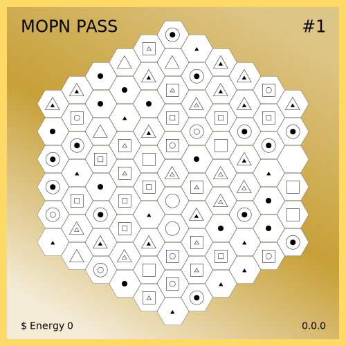

# Pass Blocks

One Pass is Contains 91 blocks. These blocks traversing the rings one by one in a spiral pattern.

Because block is a flat top orientation hexagon, that maks the pass a pointy top orientation hexagon. And all 10981 pass(with it's total 999271 blocks) also traversing the rings one by one in a spiral pattern, totally 60 rings to fill in the map.
