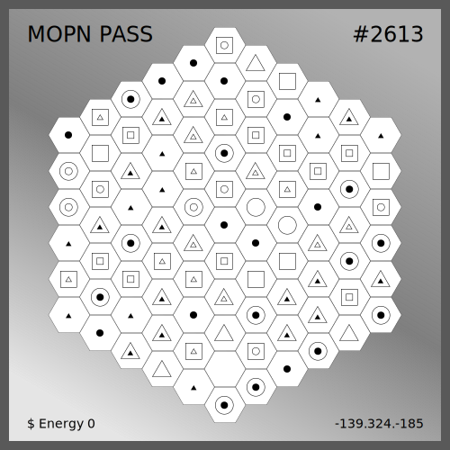

# Dynamic NFT(dNFT)

**A dynamic NFT is a non-fungible token that can change based on certain circumstances.**

The MOPN Pass uses contract-level metadata, and we read all the attributes and generate images fully on-chain, so the nft's data can change buy the external MOPN game data or event in real time.

<figure><figcaption></figcaption></figure>

 

<figure><figcaption></figcaption></figure>

