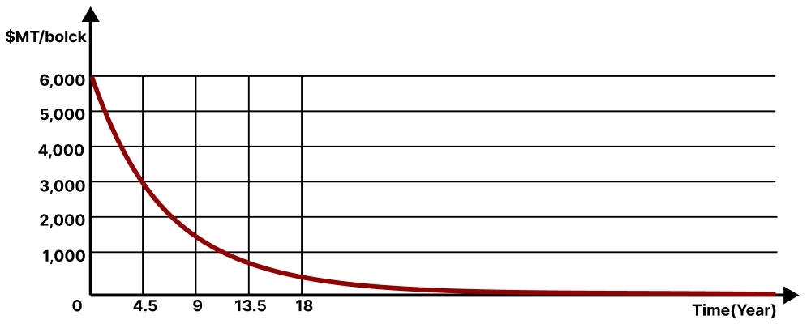
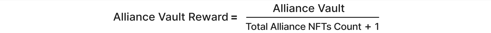
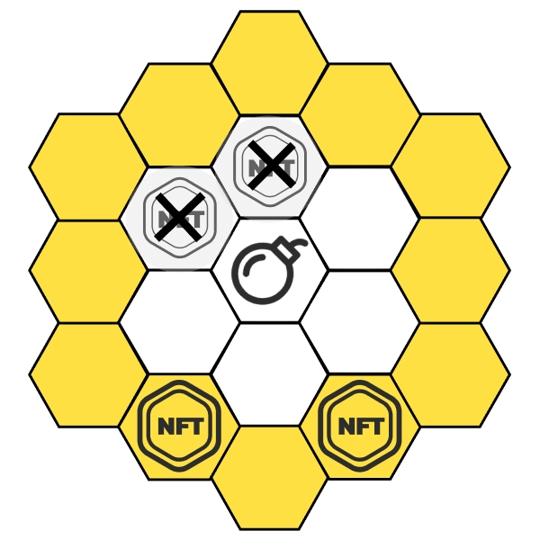
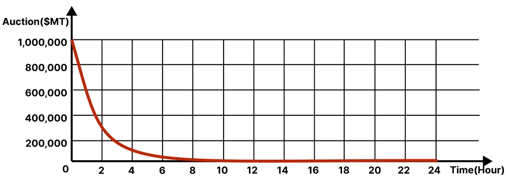

# Tokenomics

$MT

$MT, an ERC-20 token with a total supply of 100 billion, serves as the value carrier for MOPN. The initial supply is 6,000 per block, and it decreases by 0.3% every 50,000 blocks.

<figure><figcaption>
$MT Supply
</figcaption></figure>

All NFTs placed on tiles automatically receive $MT earnings per block based on their weight (requires manual claiming).

$MT is used to auction bombs and lands, with 100% of the $MT used for auction being burned.

### How to obtain

#### 1. Placing NFT Earnings

Users can earn $MT by placing their owned NFTs on unoccupied tiles on the MOPN map.

<figure><figcaption></figcaption></figure>

#### 2. Alliance Placing Reward

Placing an NFT on a tile can immediately earn an $MT reward from the alliance vault.

<figure><figcaption></figcaption></figure>

#### 3. Land Tax

Land NFT holders can permanently receive a 5% tax of the $MT generated by NFTs placed on it.

#### 4. BUY

Users can buy $MT on dex such as uniswap.

## Bomb

BOMB, a 100-token auction of an ERC-1155 token via LPDA per round, serves as the update mechanism for MONP.

Using BOMB can remove all NFTs on the 7 tiles centered around the placement point. The NFT used for bombing will not be affected.

<figure><figcaption>
Bomb effect
</figcaption></figure>

BOMB will be burned after use.&#x20;

The weight for generating $MT of the NFT which uses one BOMB will increase by 1.

### How to obtain

#### 1. LPDA

Through a Last Price Dutch Auction (LPDA), starting from 1 million $MT, 100 bombs will be auctioned off each round, with the price decreasing by 1% per minute. BOMBs can be minted at any time in quantities less than the remaining tokens for the current round.

<figure><figcaption>
BOMB Auction Price
</figcaption></figure>

Once all the 100 bombs are auctioned out, the next round will automatically start. Transactions that bid higher than the current minimum bid will receive an $MT refund for the difference.

#### 2. BUY

Users can buy BOMB on marketplaces such as OpenSea.

## Land

Land, an ERC-721 NFT with a fixed total supply of 10,981 and consisting of 91 tiles, serves as a tax tool.

<figure><figcaption>
Land NFT
</figcaption></figure>

After a land is minted, NFTs can be placed on its tiles, and the land NFT will display the occupying alliance.

The land holder can receive 5% of the $MT generated by NFTs placed on the 91 tiles on it.

All land NFTs are issued through two methods: ETH curve minting and $MT auction minting.

### How to obtain

#### 1. ETH Curve Minting

Pricing starts at 0.02 ETH, with a price increase of 1‰ for each completed ETH curve mint. ETH curve minting will be available soon.

<figure><figcaption>
The ETH Auction Price for land NFT
</figcaption></figure>

#### 2. $MT Auction Minting

Through a Dutch auction, starting from 10 million $MT, one land will be auctioned off each round, with the price decreasing by 1% per minute. When the current $MT Auction Minting is complete, the next round will automatically start.

<figure><figcaption>
The $MT Auction Price for land NFT
</figcaption></figure>

#### 3. BUY

Users can buy land NFT on marketplaces such as OpenSea.
