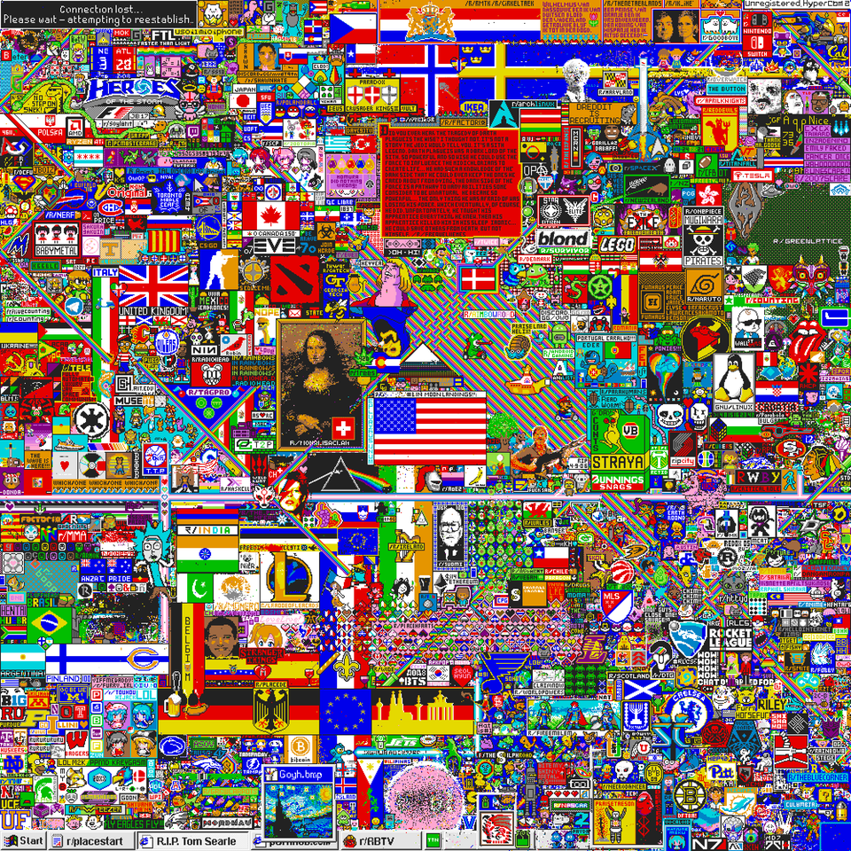

# Why We Build

### r/place

r/place is quite a successful activity held by Reddit on April Fool 2017. The rule is simple: every 5 mins, players can put a pixel on the board. The board is all white at the beginning, but with time past, all kinds of symbols and pictures are showing on the board. By the end of the activity, an epic painting drawn by millions of people together is right in front of us.

<figure><figcaption>
<strong>r/place in 2017</strong>
</figcaption></figure>

### MOPN

Inspired by r/place, we came up with the idea of MOPN. The idea is to build an open map with simple rules. The map is 100% deployed on ethereum, cannot be upgraded and NFT holder on the [collection list](economic-system/pass/community-governance.md) is free to play.

1. Anyone can place NFT in their wallet on the map.
2. There is an economic system driven by Unite to Earn. NFT holders can earn tokens according to the region of the alliance.
3. War will happen with a certain number of NFT holders placing their NFTs on the map, since the blocks are countable. Tokens will consume in the war to maintain the balance of the whole economic system.

\
The map is the battlefield of NFT collections. It is also a **graphical ranking list** of the heat level of all PFP NFT collections. The region changing on the map collections is not only about benefits but also the position of the collection in the NFTverse. All the changes will be recorded in the time capsules of MOPN being a part of NFTverse history.\

> What is Unite to Earn？
>
> Most "to Earn" on chain is about individuals using proof of work pattern. This leads to a problem that competition is among individuals. In MOPN, "to Earn" is based on behavior of the community. To maximum the "to Earn", joining the most united and powerful community is the best choice.
>
> We name this innovation pattern "Unite to Earn"

## Value

### Earn

To earn $ENERGY, all you need to do is place your NFT on the map and try your best to stay alive.

### Fun

$ENERGY can buy props with various abilities. Through strategies of props using, tactics of place\&move and diplomacy, collections may perform the plot of defeating the strong by the weak. Fun comes from the strategic thinking of an MMO-SLG (massive multiplayer onchain simulation game).

### Glory

Defeat the strong, occupy more regions, place a better position. All these are not just to earn, it is the reflection of a united and powerful community. Bigger regions bring more attention and more new blood to join in the community.

### Record

Each PFP NFT is not a set of digital data. It is a unique piece of art perpetually existing in Crypto world. It beyond the dimension of life of human beings, it is the testimony of history. And what MOPN records is an eternal historic scroll of NFTverse created by all PFP NFT holders.
